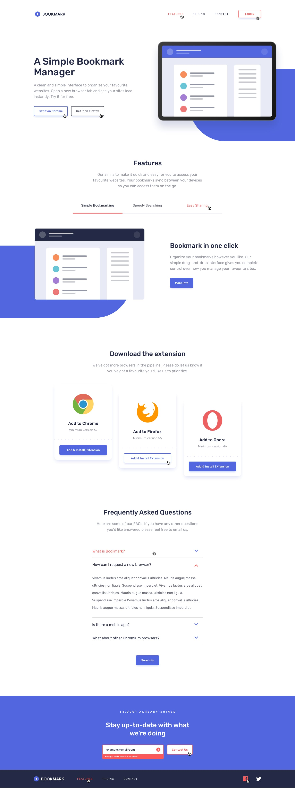

# Bookmark Landing Page

## Welcome! 👋

## Table of contents

- [Overview](#overview)
  - [The challenge](#the-challenge)
  - [How to setup the project](#how-to-setup-the-project)
  - [Screenshot](#screenshot)
  - [Links](#links)
- [My process](#my-process)
  - [Built with](#built-with)
  - [What I learned](#what-i-learned)
  - [Continued development](#continued-development)
  - [Useful resources](#useful-resources)
- [Author](#author)
- [Acknowledgments](#acknowledgments)

## Overview

### The challenge

Users should be able to:
- View the optimal layout for the site depending on their device's screen size
- See hover states for all interactive elements on the page
- Receive an error message when the newsletter form is submitted if:
  - The input field is empty
  - The email address is not formatted correctly

### How to setup the project

To set up the project locally, follow these steps:

1. Clone the repository using GitHub Desktop or Git Bash:
    ```bash
    git clone https://github.com/SartHak-0-Sach/Bookmark-landing-page_frontend_project.git
    ```
2. Open the project folder in your code editor.
3. Run the project using a live server extension or deploy it using Netlify, Vercel, or another web hosting and deployment service.

### Screenshot



### Links

- Solution URL: [GitHub Repository](https://github.com/SartHak-0-Sach/Bookmark-landing-page_frontend_project)
- Live Site URL: [Live Site](https://bookmark-landing-page-app.netlify.app/)

## My process

### Built with

- HTML5
- CSS3

You will find all the required assets in the `/images` folder. The assets are already optimized.

There is also a `style-guide.md` file containing the information you'll need, such as color palette and fonts.

### What I learned

This project has been really helpful in making me more familiar with css functionalities and understanding how to design landing pages/home-pages of websites.

<b>JavaScript code that I am proud of writing on my own</b>

```
/* Accordion Functionality */
const faqTabs = document.querySelectorAll('.faq-container .faqs .faq');

faqTabs.forEach((faqTab) => {
    faqTab.addEventListener('click', function () {
        if (faqTab.classList.contains('active')) {
            // If the user wants to close the 'only' opened faq tab
            toggleActive(faqTab);
        } else {
            // If the user wants to open a closed opened faq tab
            removeActive(faqTabs); // close the opened tab first
            toggleActive(faqTab);
        }
    });
});
```

### Continued development

The continuously learning journey of a programmer never ends. This project made me realize that there are many concepts that I need to work upon including fundamentals like flex-box and its properties, to more complex concepts like working with fetch and async await in javascript. These areas are some that I think I need to work more upon in the upcoming future as they highlight some of the most significant regions of web development that are important for every developer to know of. 

These key points mentioned here will help me grow accountable and consistent towards improving at writing good quality code and be a successful full stack developer one day.

### Useful resources

- [Harkirat Singh course notes](https://github.com/SartHak-0-Sach/harkirat-singh-course_code_and_notes) - I have added notes of all lectures along with code and lecture insights of all weeks along with bonus lectures to help you all as much as I can.
- [My development code and notes](https://github.com/SartHak-0-Sach/cwh-web-dev-playlist_code_and_notes) - These are my notes that I made while working on my development skills in initial days and did these courses. Make sure to star the repository if you like it.✨💫
- [mdn documentation](https://developer.mozilla.org/en-US/docs/Web/JavaScript/Reference/Statements/async_function) - This is an amazing article which helped me finally understand promises, async and await syntax. I'd recommend it to anyone still learning this concept.

## Author

<b><strong>Sarthak Sachdev</strong></b>
- Website - [Sarthak Sachdev](https://itsmesarthak.netlify.app/)
- LeetCode - [@sarthak_sachdev](https://leetcode.com/u/sarthak_sachdev/)
- Twitter - [@sarthak_sach69](https://www.twitter.com/sarthak_sach69)

## Acknowledgments

I feel like the solutions provided on the website and the continuous doubt solving by industry experts on discord for free is something that is unmatched by anyone else and need to be acknowledged for their efforts in improving me as a developer by suggesting the best practices in your respective tech stack.

## Got feedback for me?

I love receiving feedback! I am always looking to improve my code and take up new innovative ideas to work upon. So if you have anything you'd like to mention, please email 'hi' at saarsaach30[at]gmail[dot]com.

If you found this project helpful, consider sharing it with others to spread the knowledge!

**Happy coding!** ☺️🚀